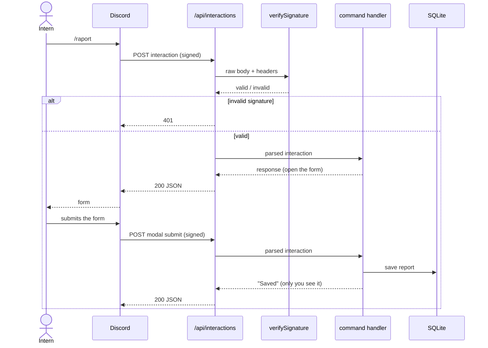
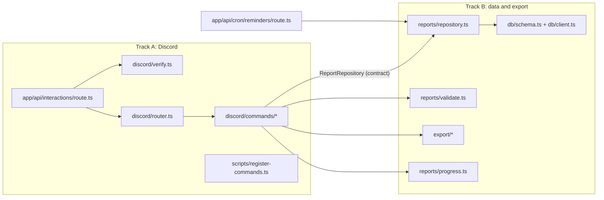

# Architecture (HLD)

🇵🇱 [Wersja polska](pl/architecture.md)

A Discord bot that collects one short work report per person per day and
exports them for the internship diary. It runs as a **Next.js app**: Discord
calls one HTTP endpoint, the app checks the request, saves the report in
the database and answers. No server process stays connected to Discord. It
runs on Vercel, with the database in Turso (D5, D12).

This document fixes the decisions that are expensive to get wrong (§4). The
ones left open (§6) are yours: make them in a pull request and write down why.

## 1. Scope

**In (MVP, by 30 October):**

- `/raport` opens a form: what I did, hours, problems, plan for tomorrow.
  Submitting it saves today's report.
- `/moje-raporty`: your last 7 reports, visible only to you.
- `/postep`: your hours so far, against the 140-hour internship.
- `/eksport`: your reports for a date range, as a file for the internship
  diary.
- A reminder in the channel at 15:00 on working days for whoever has not
  reported yet.
- Deployed on Vercel from `main`, with the database in Turso.

**Out:** a web dashboard (a stretch issue), multiple teams or servers, editing
reports from the web, attachments, AI summaries.

## 2. How a command travels



Every request must be answered within **3 seconds**, or Discord shows "The
application did not respond". Saving a report fits easily. Anything slower
(the export) answers "thinking…" first and edits the message when the result
is ready (D3).

## 3. Modules, and the line between the two tracks



The two tracks meet in **one interface**, `ReportRepository`. Agree on it in
the first issue of milestone 1 ([#5](https://github.com/DigitalVantage/discord-daily-report/issues/5)), then work in parallel. Track A uses
an in-memory implementation in tests and in local development until Track B's
SQLite one is merged.

The starting point for that contract. Change it in the contract pull request
if you have a reason:

```ts
type Report = {
  id: string
  discordUserId: string
  /** Local date in Europe/Warsaw, YYYY-MM-DD: the day the report is about. */
  day: string
  done: string
  hours: number
  problems: string | null
  plan: string | null
  createdAt: Date
  updatedAt: Date
}

interface ReportRepository {
  /** Creates today's report or replaces it: one report per person per day (D7). */
  upsert(input: Omit<Report, 'id' | 'createdAt' | 'updatedAt'>): Promise<Report>
  findByUserAndDay(discordUserId: string, day: string): Promise<Report | null>
  listByUser(discordUserId: string, range: { from: string; to: string }): Promise<Report[]>
  /** Who reported on a given day, for the reminder. */
  listUserIdsWithReport(day: string): Promise<string[]>
}
```

## 4. Decisions already made

| #   | Decision                                                                                                                                                                                                  | Why                                                                                                                                                                                                                                                                    |
| --- | --------------------------------------------------------------------------------------------------------------------------------------------------------------------------------------------------------- | ---------------------------------------------------------------------------------------------------------------------------------------------------------------------------------------------------------------------------------------------------------------------- |
| D1  | **Interactions over HTTP**, not the gateway. No discord.js.                                                                                                                                               | A slash command is a POST to a URL, so a Next.js Route Handler is the whole bot. Nothing runs 24/7, and it deploys like any other app.                                                                                                                                 |
| D2  | **Verify every request's Ed25519 signature** with Web Crypto, no SDK.                                                                                                                                     | Discord refuses to save the endpoint URL until it rejects a bad signature, and anyone could call the URL otherwise. Node 24 has Ed25519 built in.                                                                                                                      |
| D3  | **Answer in under 3 s.** Slow work: a deferred response, then edit the message.                                                                                                                           | Discord's hard limit. A deferred answer buys 15 minutes.                                                                                                                                                                                                               |
| D4  | **Commands are registered by a script** (`pnpm register-commands`), per test server in development.                                                                                                       | Registration is a separate API call, not something the app does at startup. Server-scoped commands update instantly, global ones up to an hour later.                                                                                                                  |
| D5  | **SQLite through Drizzle ORM** with the `@libsql/client` driver: a local file in development, a [Turso](https://turso.tech) database in production. Migrations with `drizzle-kit`.                        | A few hundred reports fit in SQLite, and the schema stays in TypeScript. The file system on Vercel does not survive a deploy, so production needs a hosted database; libSQL is SQLite as a service, and the same client opens `file:./data/reports.db` on your laptop. |
| D6  | **A day is a date in Europe/Warsaw**, stored as `YYYY-MM-DD` text.                                                                                                                                        | "Today" at 00:30 is a different date in UTC. One rule, in one function, tested at midnight.                                                                                                                                                                            |
| D7  | **One report per person per day.** A second `/raport` the same day replaces the first.                                                                                                                    | The diary has one line per day. Replacing is simpler than merging, and the form opens pre-filled.                                                                                                                                                                      |
| D8  | **Personal replies are ephemeral** (flag 64), visible only to the author.                                                                                                                                 | Hours and problems are not for the whole channel. The reminder is the only public message.                                                                                                                                                                             |
| D9  | **Reminders come from Vercel Cron** calling `GET /api/cron/reminders`; the handler checks the `Authorization: Bearer <CRON_SECRET>` header Vercel adds.                                                   | A serverless app has no in-process timer. The schedule lives in `vercel.json` (in UTC); the free plan runs it once a day, within the hour, which is enough for a 15:00 nudge.                                                                                          |
| D10 | **Settings come from environment variables**, checked with zod at startup.                                                                                                                                | A missing key fails at start with its name, instead of as a 401 from Discord an hour later.                                                                                                                                                                            |
| D11 | **Every developer has their own Discord application and test server.**                                                                                                                                    | Discord sends every interaction to one URL. Two people sharing an app would steal each other's requests.                                                                                                                                                               |
| D12 | **Hosted on Vercel.** Production deploys from `main`; every pull request gets a preview URL. For Discord testing each developer deploys their own copy with the `vercel` command (`docs/development.md`). | No server to maintain, and a pull request can be tried live before merge. A stable URL per developer replaces a tunnel to the laptop.                                                                                                                                  |
| D13 | **The reminder is posted through the channel's webhook** (`REMINDER_WEBHOOK_URL`), not with the bot token.                                                                                                | One URL to configure, and a webhook can write to exactly one channel. The bot token keeps one job: registering commands.                                                                                                                                               |

## 5. Discord reference

The values you will need, so you do not have to dig for them. The full
documentation is in [Interactions](https://discord.com/developers/docs/interactions/receiving-and-responding).

| What                          | Value                                                                                             |
| ----------------------------- | ------------------------------------------------------------------------------------------------- |
| Signature headers             | `X-Signature-Ed25519`, `X-Signature-Timestamp`                                                    |
| Signed message                | timestamp + **raw** request body (read it with `request.text()`, before any JSON parse)           |
| Interaction types             | `1` PING · `2` APPLICATION_COMMAND · `5` MODAL_SUBMIT                                             |
| Response types                | `1` PONG · `4` CHANNEL_MESSAGE_WITH_SOURCE · `5` DEFERRED_CHANNEL_MESSAGE_WITH_SOURCE · `9` MODAL |
| Ephemeral flag                | `flags: 64`                                                                                       |
| Edit the deferred answer      | `PATCH /webhooks/{application_id}/{interaction_token}/messages/@original`                         |
| Register test-server commands | `PUT /applications/{application_id}/guilds/{guild_id}/commands`                                   |
| Post in a channel (reminder)  | `POST /channels/{channel_id}/messages` with header `Authorization: Bot <token>`                   |

## 6. Left to you

Decide each in its issue, and explain the choice in the pull request:

1. **The table schema.** Columns, types, indexes, and how D7 is enforced (a
   unique index?).
2. **The form.** Which fields are required, their length limits, and what the
   hours field accepts (`7`, `7.5`, `7,5`?).
3. **The export format.** Markdown, CSV, PDF? It depends on the school's
   diary template; ask your mentor for it.
4. **The command names and texts.** Polish, short, consistent.
5. **Whether a web page is worth building at all** (stretch milestone).

## 7. Risks

| Risk                                            | Mitigation                                                                                                                       |
| ----------------------------------------------- | -------------------------------------------------------------------------------------------------------------------------------- |
| Discord cannot reach `localhost`                | Your own Vercel deployment (`docs/development.md` §3). Check it with the PING issue first.                                       |
| A request takes longer than 3 s on a cold start | Keep handlers small. Defer anything that calls another API.                                                                      |
| The database disappears                         | It is a Turso service, not a file on the server. Turso keeps one day of point-in-time restore; `/eksport` is the long-term copy. |
| The reminder fires at the wrong hour            | The schedule in `vercel.json` is UTC: 15:00 in Warsaw is 13:00 UTC in summer time and 14:00 UTC after 25 October.                |
| The bot token leaks                             | Server side only, never with `NEXT_PUBLIC_`. If it leaks, reset it in the Developer Portal and tell your mentor.                 |

## 8. What changed on the way, and why

| Where     | Was                                              | Is                                                                          | Why                                                                                                    |
| --------- | ------------------------------------------------ | --------------------------------------------------------------------------- | ------------------------------------------------------------------------------------------------------ |
| D5        | SQLite file with `better-sqlite3`, Docker volume | Turso through `@libsql/client`, a local file in development                 | Vercel's file system does not survive a deploy; one client covers file, Turso and `:memory:` (#1, #14) |
| D9        | external scheduler, `POST` with `CRON_SECRET`    | Vercel Cron, `GET`, `Authorization: Bearer` added by Vercel                 | no server to run cron on; the Hobby plan's daily run is enough for 15:00 (#1, #32)                     |
| D12 (new) | own server, Docker                               | Vercel from `main`, previews per pull request, own deployment per developer | nothing to maintain; a stable URL per developer replaces a tunnel (#1, #4)                             |
| D13 (new) | bot token + `DISCORD_REPORT_CHANNEL_ID`          | the channel's webhook                                                       | one setting, one channel, no token permissions (#32)                                                   |
| §6.2      | open                                             | hours as `7`, `7.5`, `7,5`, `7 h`; 0,25–16; texts up to 1000                | decided in #17                                                                                         |
| §6.3      | open                                             | Markdown, every working day visible                                         | decided in #27 without the school's template; reversible                                               |
| #24       | after the handlers                               | before them                                                                 | the texts in one file first means no refactor later                                                    |
| #31       | open                                             | 7 days back, older ones by the mentor                                       | a diary rewritten weeks later is not a daily log                                                       |
| #34       | Dockerfile                                       | closed                                                                      | no Docker on Vercel                                                                                    |
