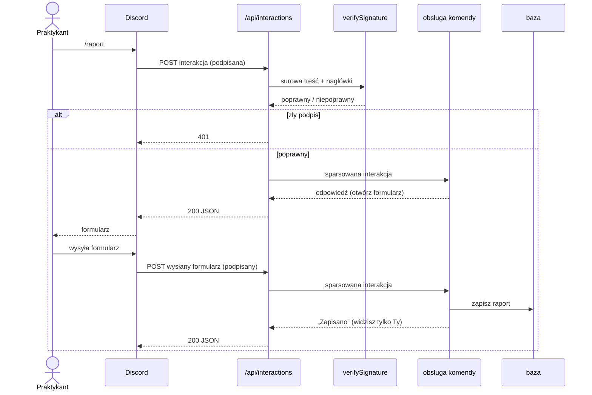
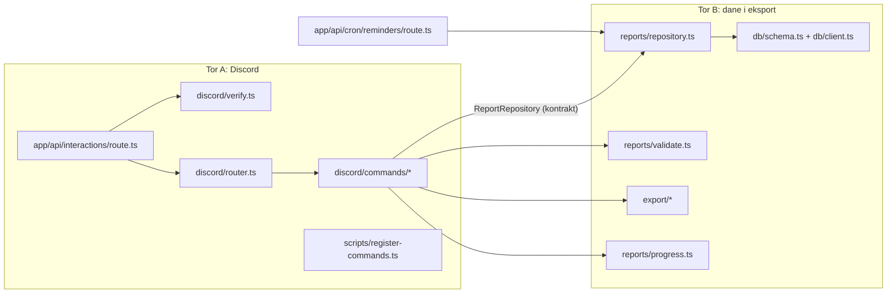

# Architektura (HLD)

🇬🇧 [English version](../architecture.md)

Bot na Discorda, który zbiera jeden krótki raport z pracy na osobę na dzień i
eksportuje je do dziennika praktyk. Działa jako **aplikacja Next.js**: Discord
woła jeden endpoint HTTP, aplikacja sprawdza żądanie, zapisuje raport w bazie
i odpowiada. Żaden proces nie jest stale połączony z Discordem. Aplikacja
działa na Vercelu, a baza w Turso (D5, D12).

Ten dokument ustala decyzje, które drogo kosztują, gdy są złe (§4). Te, które
zostały otwarte (§6), należą do Was: podejmijcie je w pull requeście i
zapiszcie dlaczego.

## Słowniczek

| Słowo                       | Co to znaczy                                                                           |
| --------------------------- | -------------------------------------------------------------------------------------- |
| **endpoint**                | adres w aplikacji, pod który ktoś (tu Discord) wysyła żądanie HTTP                     |
| **interakcja**              | wiadomość od Discorda: ktoś użył komendy, wysłał formularz albo Discord pyta „żyjesz?” |
| **podpis** (signature)      | dowód, że żądanie naprawdę przyszło z Discorda; sprawdzamy go kluczem publicznym       |
| **handler** (obsługa)       | funkcja, która dostaje interakcję i zwraca odpowiedź                                   |
| **repozytorium** (w kodzie) | obiekt, przez który zapisujemy i czytamy raporty; nie mylić z repozytorium Gita        |
| **kontrakt** (interfejs)    | ustalona lista metod i typów; obie strony się jej trzymają                             |
| **milestone** (etap)        | grupa zadań z terminem                                                                 |

## 1. Zakres

**W środku (MVP, do 30 października):**

- `/raport` otwiera formularz: co zrobiłem, godziny, problemy, plan na jutro.
  Wysłanie go zapisuje dzisiejszy raport.
- `/moje-raporty`: Twoje ostatnie 7 raportów, widoczne tylko dla Ciebie.
- `/postep`: Twoje godziny do tej pory, w stosunku do 140 godzin praktyk.
- `/eksport`: Twoje raporty z zakresu dat, jako plik do dziennika praktyk.
- Przypomnienie na kanale o 15:00 w dni robocze dla tych, którzy jeszcze nie
  wysłali raportu.
- Wdrożone na Vercelu z gałęzi `main`, z bazą w Turso.

**Poza zakresem:** panel WWW (zadanie dodatkowe), wiele zespołów lub serwerów,
edycja raportów z przeglądarki, załączniki, podsumowania przez AI.

## 2. Jak wędruje komenda



Na każde żądanie trzeba odpowiedzieć w **3 sekundy**, inaczej Discord pokazuje
„The application did not respond”. Zapis raportu mieści się spokojnie. Wszystko
wolniejsze (eksport) najpierw odpowiada „myślę…”, a gdy wynik jest gotowy,
edytuje wiadomość (D3).

## 3. Moduły i granica między torami



Oba tory spotykają się w **jednym interfejsie**, `ReportRepository`. Ustalcie
go w pierwszym zadaniu etapu 1
([#5](https://github.com/DigitalVantage/discord-daily-report/issues/5)), potem
pracujcie równolegle. Tor A używa wersji w pamięci w testach i lokalnie, dopóki
wersja SQLite z toru B nie zostanie zmergowana.

Punkt wyjścia dla tego kontraktu. Zmieńcie go w pull requeście z kontraktem,
jeśli macie powód:

```ts
type Report = {
  id: string
  discordUserId: string
  /** Data lokalna w Europe/Warsaw, YYYY-MM-DD: dzień, którego dotyczy raport. */
  day: string
  done: string
  hours: number
  problems: string | null
  plan: string | null
  createdAt: Date
  updatedAt: Date
}

interface ReportRepository {
  /** Tworzy dzisiejszy raport albo go zastępuje: jeden raport na osobę na dzień (D7). */
  upsert(input: Omit<Report, 'id' | 'createdAt' | 'updatedAt'>): Promise<Report>
  findByUserAndDay(discordUserId: string, day: string): Promise<Report | null>
  listByUser(discordUserId: string, range: { from: string; to: string }): Promise<Report[]>
  /** Kto wysłał raport danego dnia, dla przypomnienia. */
  listUserIdsWithReport(day: string): Promise<string[]>
}
```

## 4. Decyzje już podjęte

| #   | Decyzja                                                                                                                                                                                                       | Dlaczego                                                                                                                                                                                                                                                         |
| --- | ------------------------------------------------------------------------------------------------------------------------------------------------------------------------------------------------------------- | ---------------------------------------------------------------------------------------------------------------------------------------------------------------------------------------------------------------------------------------------------------------- |
| D1  | **Interakcje przez HTTP**, nie przez gateway. Bez discord.js.                                                                                                                                                 | Komenda to POST na adres, więc Route Handler w Next.js jest całym botem. Nic nie działa 24/7, a wdraża się jak każdą inną aplikację.                                                                                                                             |
| D2  | **Sprawdzamy podpis Ed25519 każdego żądania** przez Web Crypto, bez SDK.                                                                                                                                      | Discord nie zapisze adresu endpointu, dopóki ten nie odrzuci złego podpisu, a bez tego każdy mógłby wołać ten adres. Node 24 ma Ed25519 wbudowane.                                                                                                               |
| D3  | **Odpowiedź w mniej niż 3 s.** Wolna praca: odpowiedź odroczona, potem edycja wiadomości.                                                                                                                     | Twardy limit Discorda. Odpowiedź odroczona daje 15 minut.                                                                                                                                                                                                        |
| D4  | **Komendy rejestruje skrypt** (`pnpm register-commands`), w developmencie na każdy serwer testowy osobno.                                                                                                     | Rejestracja to osobne wywołanie API, nie coś, co aplikacja robi przy starcie. Komendy na serwer aktualizują się od razu, globalne nawet po godzinie.                                                                                                             |
| D5  | **SQLite przez Drizzle ORM** ze sterownikiem `@libsql/client`: lokalnie plik, na produkcji baza w [Turso](https://turso.tech). Migracje przez `drizzle-kit`.                                                  | Kilkaset raportów mieści się w SQLite, a schemat zostaje w TypeScripcie. System plików na Vercelu nie przeżywa deployu, więc produkcja potrzebuje bazy jako usługi; libSQL to SQLite jako usługa, a ten sam klient otwiera `file:./data/reports.db` na laptopie. |
| D6  | **Dzień to data w Europe/Warsaw**, zapisana jako tekst `YYYY-MM-DD`.                                                                                                                                          | „Dziś” o 00:30 to w UTC inna data. Jedna zasada, w jednej funkcji, przetestowana o północy.                                                                                                                                                                      |
| D7  | **Jeden raport na osobę na dzień.** Drugi `/raport` tego samego dnia zastępuje pierwszy.                                                                                                                      | Dziennik ma jedną linię na dzień. Zastąpienie jest prostsze niż łączenie, a formularz otwiera się wypełniony.                                                                                                                                                    |
| D8  | **Odpowiedzi osobiste są efemeryczne** (flaga 64), widoczne tylko dla autora.                                                                                                                                 | Godziny i problemy nie są dla całego kanału. Przypomnienie to jedyna publiczna wiadomość.                                                                                                                                                                        |
| D9  | **Przypomnienia wysyła Vercel Cron**, wołając `GET /api/cron/reminders`; obsługa sprawdza nagłówek `Authorization: Bearer <CRON_SECRET>`, który Vercel dodaje.                                                | Aplikacja serverless nie ma własnego zegara. Harmonogram jest w `vercel.json` (w UTC); darmowy plan uruchamia go raz dziennie, w ciągu godziny, co wystarczy na przypomnienie o 15:00.                                                                           |
| D10 | **Ustawienia pochodzą ze zmiennych środowiskowych**, sprawdzanych przez zod przy starcie.                                                                                                                     | Brakujący klucz zatrzymuje start z nazwą klucza, zamiast dać 401 z Discorda godzinę później.                                                                                                                                                                     |
| D11 | **Każdy deweloper ma własną aplikację Discord i własny serwer testowy.**                                                                                                                                      | Discord wysyła każdą interakcję na jeden adres. Dwie osoby na jednej aplikacji zabierałyby sobie żądania.                                                                                                                                                        |
| D12 | **Hosting na Vercelu.** Produkcja wdraża się z `main`; każdy pull request dostaje adres podglądowy. Do testów z Discordem każdy deweloper wdraża własną kopię poleceniem `vercel` (`docs/pl/development.md`). | Nie ma serwera do utrzymania, a pull request da się wypróbować na żywo przed merge'em. Stały adres na dewelopera zastępuje tunel do laptopa.                                                                                                                     |

## 5. Ściąga z Discorda

Wartości, których będziecie potrzebować, żeby ich nie szukać. Pełna
dokumentacja: [Interactions](https://discord.com/developers/docs/interactions/receiving-and-responding).

| Co                                      | Wartość                                                                                           |
| --------------------------------------- | ------------------------------------------------------------------------------------------------- |
| Nagłówki z podpisem                     | `X-Signature-Ed25519`, `X-Signature-Timestamp`                                                    |
| Podpisana wiadomość                     | czas + **surowa** treść żądania (czytaj przez `request.text()`, przed parsowaniem JSON)           |
| Typy interakcji                         | `1` PING · `2` APPLICATION_COMMAND · `5` MODAL_SUBMIT                                             |
| Typy odpowiedzi                         | `1` PONG · `4` CHANNEL_MESSAGE_WITH_SOURCE · `5` DEFERRED_CHANNEL_MESSAGE_WITH_SOURCE · `9` MODAL |
| Flaga „tylko dla autora”                | `flags: 64`                                                                                       |
| Edycja odroczonej odpowiedzi            | `PATCH /webhooks/{application_id}/{interaction_token}/messages/@original`                         |
| Rejestracja komend na serwerze testowym | `PUT /applications/{application_id}/guilds/{guild_id}/commands`                                   |
| Wiadomość na kanale (przypomnienie)     | `POST /channels/{channel_id}/messages` z nagłówkiem `Authorization: Bot <token>`                  |

## 6. Do Waszej decyzji

Każdą podejmijcie w jej zadaniu i wyjaśnijcie wybór w pull requeście:

1. **Schemat tabeli.** Kolumny, typy, indeksy i jak pilnowane jest D7 (indeks
   unikalny?).
2. **Formularz.** Które pola są wymagane, limity długości i co przyjmuje pole
   godzin (`7`, `7.5`, `7,5`?).
3. **Format eksportu.** Markdown, CSV, PDF? Zależy od wzoru dziennika ze
   szkoły; poproś o niego opiekuna.
4. **Nazwy i teksty komend.** Po polsku, krótko, spójnie.
5. **Czy strona WWW jest w ogóle warta budowania** (etap dodatkowy).

## 7. Ryzyka

| Ryzyko                                     | Co z tym robimy                                                                                                        |
| ------------------------------------------ | ---------------------------------------------------------------------------------------------------------------------- |
| Discord nie dosięga `localhost`            | Własny deploy na Vercelu (`docs/pl/development.md` §3). Sprawdź to najpierw zadaniem z PING.                           |
| Żądanie trwa ponad 3 s przy zimnym starcie | Trzymaj obsługę małą. Odraczaj wszystko, co woła inne API.                                                             |
| Baza znika                                 | To usługa Turso, nie plik na serwerze. Turso trzyma jeden dzień przywracania w czasie; `/eksport` to kopia na dłużej.  |
| Przypomnienie przychodzi o złej godzinie   | Harmonogram w `vercel.json` jest w UTC: 15:00 w Warszawie to 13:00 UTC w czasie letnim i 14:00 UTC po 25 października. |
| Wycieka token bota                         | Tylko po stronie serwera, nigdy z `NEXT_PUBLIC_`. Jeśli wyciekł, zresetuj go w Developer Portal i powiedz opiekunowi.  |
